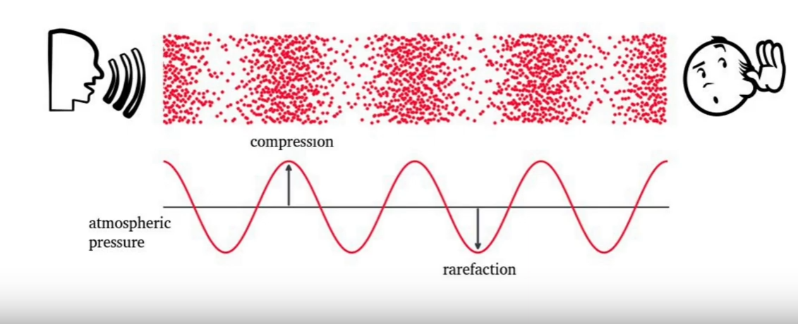
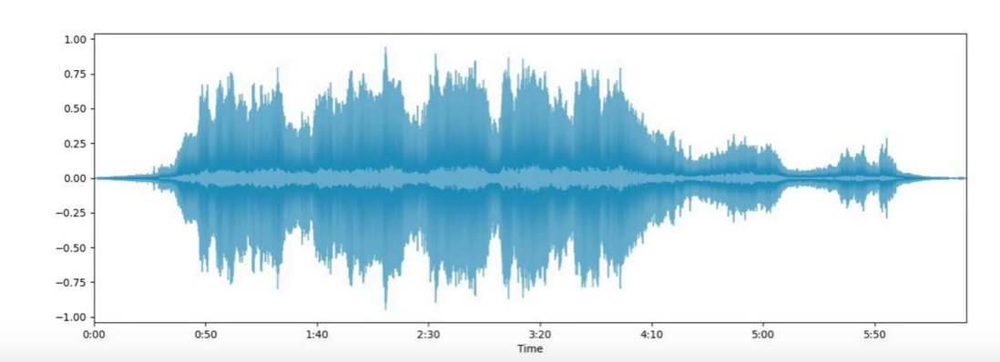
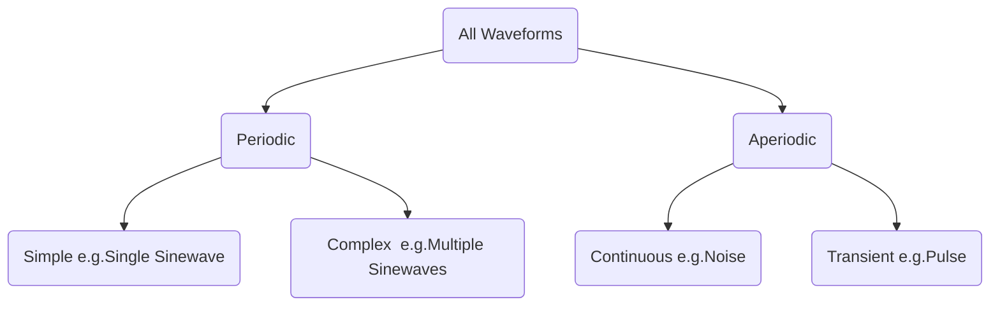
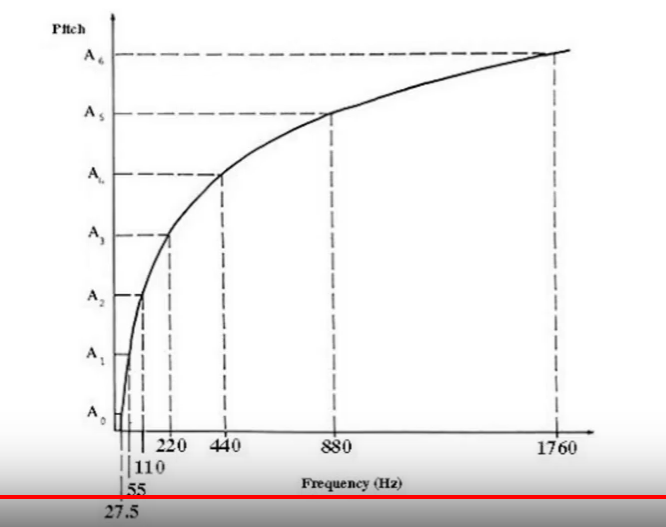

## __Sound:__
- It is a wave.
- Produced by pressure difference in the air molecules.

## __Waveform:__

- Deviation of air pressure from 0.00 with respect to time.
- Carries multifactorial informations:
    - Frequency
    - Timbre
    - Intensity
## __Periodic and Aperiodic Sounds:__

# Extra
    - Larger Amplitude means Louder.
    - Although wave amplitude is generally associated with loudness, there is some interaction between frequency and amplitude in our perception of loudness within the audible range.
    -  For example, a 10 Hz sound wave is inaudible no matter the amplitude of the wave. A 1000 Hz sound wave, on the other hand, would vary dramatically in terms of perceived loudness as the amplitude of the wave increased.
    - [Source]: https://www.linkedin.com/learning/audio-foundations-eq-and-filters/the-perception-of-frequency-and-amplitude?trk=lynda_redirect_learning
## __Pitch-Freq Chart__

## __Mapping pitch to frequency__

$$
F(p) = 2^\frac{p-69}{12} \operatorname{x} 440
$$
$$
F(p+1)/F(p) = 2^\frac{1}{12} = 1.059
$$

## __Cents:__
- Octave divided in 1200 cents
- 100 cents in a semitone
- Noticeable pitch difference: 10-25 cents